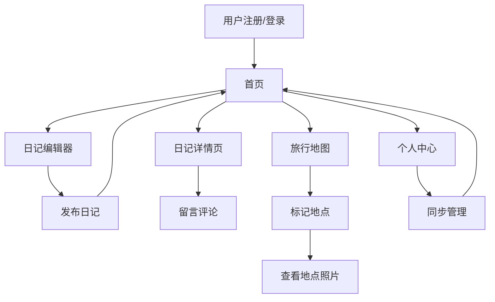

## 1. Product Overview
个人日记与旅行记录分享网站，专注于移动端体验，实现全平台数据同步。
- 帮助用户记录日常生活和旅行经历，分享心情和照片，与朋友互动。
- 目标用户为喜欢记录生活、分享旅行的年轻人，特别是注重移动端体验的用户。

## 2. Core Features

### 2.1 User Roles
| Role | Registration Method | Core Permissions |
|------|---------------------|------------------|
| Normal User | Email registration | 创建日记、上传图片、查看朋友日记、留言评论、地图标记 |

### 2.2 Feature Module
1. **首页**：日记列表、导航栏、用户信息
2. **日记编辑器**：文字输入、图片上传、心情选择
3. **日记详情页**：日记内容、图片展示、评论区
4. **旅行地图**：地图标记、照片查看
5. **个人中心**：用户信息、设置、同步管理

### 2.3 Page Details
| Page Name | Module Name | Feature description |
|-----------|-------------|---------------------|
| 首页 | 日记列表 | 展示用户所有日记，按时间倒序排列，包含日记标题、日期、心情和缩略图 |
| 首页 | 导航栏 | 包含首页、地图、编辑器、个人中心等导航选项 |
| 日记编辑器 | 文字输入 | 支持多行文本输入，富文本编辑 |
| 日记编辑器 | 图片上传 | 支持多张图片上传，无大小限制，自动压缩预览 |
| 日记编辑器 | 心情选择 | 提供多种可爱表情选择，如开心、平静、难过、兴奋等 |
| 日记详情页 | 日记内容 | 展示完整日记文本，包含日期、时间和心情 |
| 日记详情页 | 图片展示 | 大图展示上传的图片，支持点击查看原图 |
| 日记详情页 | 评论区 | 显示朋友的评论，支持回复和互动 |
| 旅行地图 | 地图标记 | 在地图上标记旅行地点，点击标记查看该地点的照片 |
| 旅行地图 | 照片查看 | 弹出窗口展示该地点的所有照片 |
| 个人中心 | 用户信息 | 显示用户头像、昵称、个人简介 |
| 个人中心 | 设置 | 账号设置、隐私设置、同步设置 |
| 个人中心 | 同步管理 | 手动触发同步，查看同步状态 |

## 3. Core Process
用户流程：
1. 用户注册/登录
2. 进入首页查看日记列表
3. 点击编辑器创建新日记
4. 输入文字，上传图片，选择心情
5. 发布日记
6. 朋友查看日记并留言
7. 用户在地图上标记旅行地点
8. 点击地图标记查看该地点的照片
9. 数据自动同步到云端
10. 在其他设备登录后查看同步数据

## 4. User Interface Design
### 4.1 Design Style
- 主色调：柔和的奶油色 (#FFF8E1)、马卡龙色系（浅粉 #FFD1DC、薄荷绿 #B5EAD7、淡紫 #E6E6FA、奶黄 #FFFDD0）
- 按钮风格：圆角按钮，柔和阴影，点击时有轻微的弹性动画
- 字体：英文使用 'Comic Neue' 或 'Patrick Hand'，中文使用圆润可爱的字体
- 布局风格：卡片式布局，顶部导航栏，移动端优先设计
- 图标/表情风格：可爱的手绘风格，集成 Pingu 企鹅和小熊元素

### 4.2 Page Design Overview
| Page Name | Module Name | UI Elements |
|-----------|-------------|-------------|
| 首页 | 日记列表 | 卡片式设计，圆角边框，柔和阴影，每张卡片包含日期、心情表情、标题和缩略图，Pingu 企鹅贴纸作为装饰 |
| 日记编辑器 | 文字输入 | 简洁的输入框，支持自动换行，手写风格字体，背景为奶油色 |
| 日记编辑器 | 图片上传 | 圆形上传按钮，带有小熊图标，上传后显示图片缩略图，支持拖拽排序 |
| 日记编辑器 | 心情选择 | 一排可爱的表情按钮，点击后有选中动画，每个表情都有对应的颜色 |
| 日记详情页 | 日记内容 | 大字体展示，行距宽松，顶部显示日期、时间和心情表情，背景为奶油色 |
| 日记详情页 | 图片展示 | 图片以网格形式排列，点击放大，支持左右滑动切换 |
| 日记详情页 | 评论区 | 圆角输入框，评论气泡为马卡龙色，带有小熊头像图标 |
| 旅行地图 | 地图标记 | 自定义标记图标，使用 Pingu 企鹅形象，点击后弹出圆角信息窗口 |
| 个人中心 | 用户信息 | 圆形头像，带有小熊边框，背景为淡紫色，个人简介区域为卡片式设计 |
| 个人中心 | 设置 | 列表式布局，每个设置项带有图标，开关按钮为马卡龙色 |

### 4.3 Responsiveness
- 移动端优先设计，针对触摸交互优化
- 响应式布局，适配手机、平板、PC 等不同屏幕尺寸
- 移动端使用底部导航栏，PC 端使用顶部导航栏
- 图片和文本大小会根据屏幕尺寸自动调整
- 触摸目标大小至少 44×44px，确保在移动设备上易于点击

### 4.4 3D Scene Guidance
不适用，本项目为 2D 网页应用。