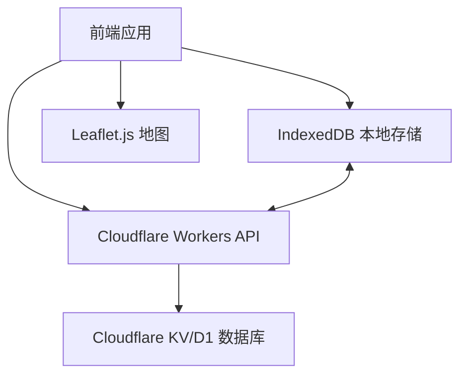
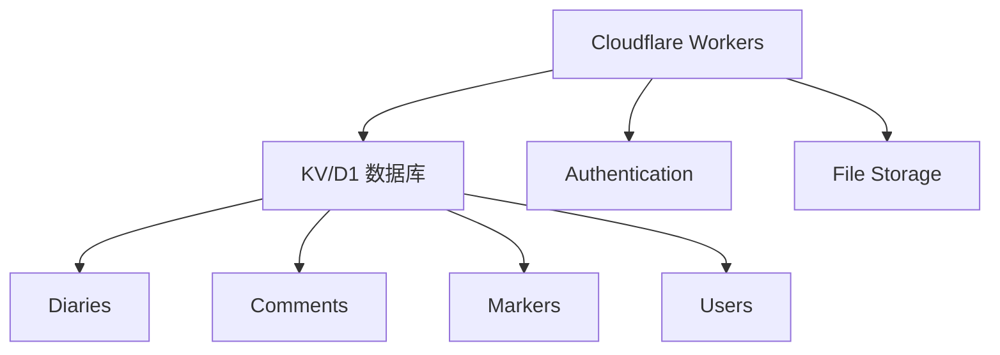
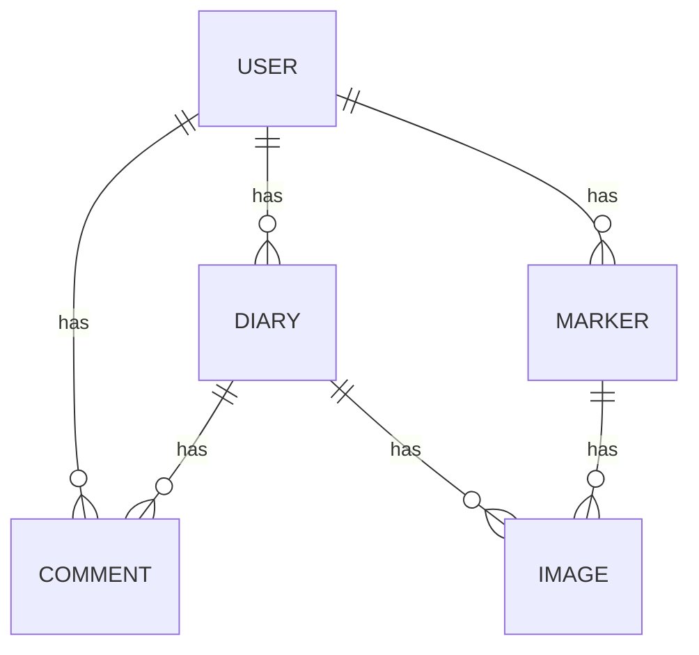

## 1. Architecture Design


## 2. Technology Description
- 前端：纯 HTML、CSS 和 Vanilla JavaScript，保证轻量和高效
- 地图：Leaflet.js 库和 OpenStreetMap 瓦片
- 数据与后端：
  - 前端：IndexedDB 离线优先存储
  - 后端：Cloudflare Workers KV 或 D1 数据库
- 部署：Cloudflare Pages

## 3. Route Definitions
| Route | Purpose |
|-------|---------|
| / | 首页，展示日记列表 |
| /editor | 日记编辑器 |
| /diary/:id | 日记详情页 |
| /map | 旅行地图 |
| /profile | 个人中心 |

## 4. API Definitions
### 4.1 认证 API
| Method | Endpoint | Description |
|--------|----------|-------------|
| POST | /api/auth/register | 用户注册 |
| POST | /api/auth/login | 用户登录 |
| POST | /api/auth/logout | 用户登出 |

### 4.2 日记 API
| Method | Endpoint | Description |
|--------|----------|-------------|
| GET | /api/diaries | 获取用户所有日记 |
| POST | /api/diaries | 创建新日记 |
| GET | /api/diaries/:id | 获取单个日记详情 |
| PUT | /api/diaries/:id | 更新日记 |
| DELETE | /api/diaries/:id | 删除日记 |

### 4.3 评论 API
| Method | Endpoint | Description |
|--------|----------|-------------|
| GET | /api/diaries/:id/comments | 获取日记评论 |
| POST | /api/diaries/:id/comments | 添加评论 |
| DELETE | /api/comments/:id | 删除评论 |

### 4.4 地图标记 API
| Method | Endpoint | Description |
|--------|----------|-------------|
| GET | /api/markers | 获取所有地图标记 |
| POST | /api/markers | 创建新标记 |
| GET | /api/markers/:id | 获取单个标记详情 |
| PUT | /api/markers/:id | 更新标记 |
| DELETE | /api/markers/:id | 删除标记 |

### 4.5 同步 API
| Method | Endpoint | Description |
|--------|----------|-------------|
| POST | /api/sync | 同步数据 |
| GET | /api/sync/status | 获取同步状态 |

## 5. Server Architecture Diagram


## 6. Data Model
### 6.1 Data Model Definition


### 6.2 Data Definition Language
#### Users Table
```sql
CREATE TABLE IF NOT EXISTS users (
  id TEXT PRIMARY KEY,
  email TEXT UNIQUE NOT NULL,
  password TEXT NOT NULL,
  name TEXT NOT NULL,
  avatar TEXT,
  created_at TIMESTAMP DEFAULT CURRENT_TIMESTAMP
);
```

#### Diaries Table
```sql
CREATE TABLE IF NOT EXISTS diaries (
  id TEXT PRIMARY KEY,
  user_id TEXT NOT NULL,
  title TEXT,
  content TEXT NOT NULL,
  mood TEXT NOT NULL,
  created_at TIMESTAMP DEFAULT CURRENT_TIMESTAMP,
  updated_at TIMESTAMP DEFAULT CURRENT_TIMESTAMP
);
```

#### Comments Table
```sql
CREATE TABLE IF NOT EXISTS comments (
  id TEXT PRIMARY KEY,
  diary_id TEXT NOT NULL,
  user_id TEXT NOT NULL,
  content TEXT NOT NULL,
  created_at TIMESTAMP DEFAULT CURRENT_TIMESTAMP
);
```

#### Markers Table
```sql
CREATE TABLE IF NOT EXISTS markers (
  id TEXT PRIMARY KEY,
  user_id TEXT NOT NULL,
  lat REAL NOT NULL,
  lng REAL NOT NULL,
  name TEXT NOT NULL,
  created_at TIMESTAMP DEFAULT CURRENT_TIMESTAMP
);
```

#### Images Table
```sql
CREATE TABLE IF NOT EXISTS images (
  id TEXT PRIMARY KEY,
  diary_id TEXT,
  marker_id TEXT,
  user_id TEXT NOT NULL,
  url TEXT NOT NULL,
  thumbnail_url TEXT NOT NULL,
  created_at TIMESTAMP DEFAULT CURRENT_TIMESTAMP
);
```

## 7. IndexedDB Schema
### 7.1 Stores
- **users**: 存储用户信息
- **diaries**: 存储日记数据
- **comments**: 存储评论数据
- **markers**: 存储地图标记数据
- **images**: 存储图片数据
- **sync_status**: 存储同步状态

### 7.2 Indexes
- **diaries**: by user_id, created_at
- **comments**: by diary_id, created_at
- **markers**: by user_id, created_at
- **images**: by diary_id, marker_id

## 8. Cloudflare Workers Implementation
### 8.1 KV Namespaces
- **diary-app-users**: 存储用户数据
- **diary-app-diaries**: 存储日记数据
- **diary-app-comments**: 存储评论数据
- **diary-app-markers**: 存储地图标记数据
- **diary-app-images**: 存储图片数据

### 8.2 Worker Routes
- `api/*`：处理所有 API 请求
- `/*`：提供静态文件

## 9. Deployment to Cloudflare Pages
### 9.1 Build Process
1. 构建静态文件
2. 上传到 Cloudflare Pages
3. 配置自定义域（可选）

### 9.2 Headers Configuration
在 `_headers` 文件中添加以下规则：
```
/*.js
  Content-Type: application/javascript; charset=utf-8
```

### 9.3 Environment Variables
- `KV_NAMESPACE_ID`: KV 命名空间 ID
- `D1_DATABASE_ID`: D1 数据库 ID
- `SECRET_KEY`: 用于 JWT 签名的密钥